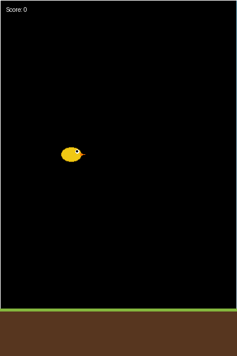

# FlappyAI — NEAT Neuroevolution tự học chơi Flappy Bird

[](https://python.org)
[](https://neat-python.readthedocs.io/)

> Một con chim ảo tự học cách chơi Flappy Bird qua tiến hóa — không cần dữ liệu huấn luyện,
> không cần label, không cần mạng neural được thiết kế sẵn. Chỉ có **chọn lọc tự nhiên** qua từng thế hệ.

---

## Demo

<p align="center">
  
  <br>
  <em>AI tự động chơi Flappy Bird — đạt 27 cột trung bình (gen 140)</em>
</p>

---

## Mục lục

- [Tổng quan](#tổng-quan)
- [Kiến trúc hệ thống](#kiến-trúc-hệ-thống)
- [Cách hoạt động](#cách-hoạt-động)
- [Hướng dẫn train](#hướng-dẫn-train)
- [Tinh chỉnh thông số](#tinh-chỉnh-thông-số-cho-độ-chính-xác-tốt-hơn)
- [Phương án triển khai](#phương-án-triển-khai)
- [Kết quả thực nghiệm](#kết-quả-thực-nghiệm)
- [Cấu trúc thư mục](#cấu-trúc-thư-mục)
- [FAQ & Troubleshooting](#faq--troubleshooting)

---

## Tổng quan

Dự án này sử dụng thuật toán **NEAT (NeuroEvolution of Augmenting Topologies)** để huấn luyện
một mạng neural điều khiển chim Flappy Bird. Điểm đặc biệt:

| Tính năng | Mô tả |
|---|---|
| **Không cần mạng thiết kế sẵn** | NEAT tự động thêm/xóa node hidden khi cần |
| **Game engine thuần Python** | Headless, chạy được không cần GPU |
| **Dashboard web real-time** | Biểu đồ fitness, mạng neural, chơi thử AI/manual |
| **Replay với Pygame** | Xem AI chơi + topology mạng + biểu đồ fitness lịch sử |
| **So sánh công bằng giữa các genome** | Fixed seeds mỗi generation — tất cả genome đối mặt cùng layout |
| **Lưu genome tốt nhất mọi thời đại** | Không chỉ winner cuối cùng — giữ lại best-ever qua generations |

---

## Kiến trúc hệ thống

```
                    ┌──────────────────────┐
                    │   config-feedforward.txt │
                    │   (NEAT hyperparams)   │
                    └──────────┬───────────┘
                               │
┌──────────────────────────────▼───────────────────────────────┐
│                     train.py                                  │
│  ┌──────────┐   ┌──────────────┐   ┌───────────────────────┐  │
│  │Population│ → │eval_genomes()│ → │LogReporter (tracking) │  │
│  │  (400)   │   │  (6 runs/    │   │ + Fitness-based       │  │
│  │          │   │   genome)    │   │   selection            │  │
│  └──────────┘   └──────┬───────┘   └───────────────────────┘  │
│                         │                                       │
│                    ┌────▼───────┐                               │
│                    │ game.py     │   (headless game engine)     │
│                    │ step()      │                               │
│                    │ get_state() │                               │
│                    │ collision   │                               │
│                    └────────────┘                               │
└───────────────────────────────────────────────────────────────┘
                               │
                    ┌──────────▼──────────┐
                    │    logs/             │
                    │  ├─training.jsonl    │  ← per-generation stats
                    │  ├─winner.pkl        │  ← best genome (pickle)
                    │  └─winner_net.json   │  ← best network (JSON)
                    └──────────────────────┘
                               │
          ┌────────────────────┼────────────────────┐
          ▼                    ▼                    ▼
   ┌──────────┐        ┌───────────┐        ┌──────────┐
   │ server.py │        │ replay.py │        │ train.py │
   │ + web/    │        │ + Pygame  │        │(terminal)│
   │ Browser   │        │ Desktop   │        │ Headless │
   └──────────┘        └───────────┘        └──────────┘
```

---

## Cách hoạt động

### Mạng neural

Mỗi con chim được điều khiển bởi một mạng feedforward với:

**5 inputs** (chuẩn hóa về [0, 1]):

| # | Tín hiệu | Mô tả | Công thức |
|---|---|---|---|
| 1 | `bird_y` | Vị trí dọc của chim | `y / PLAY_H` |
| 2 | `velocity` | Vận tốc (0=vừa đập cánh, 1=rơi nhanh) | `(vy - FLAP_VY) / (MAX_VY - FLAP_VY)` |
| 3 | `pipe_dx` | Khoảng cách ngang đến cột tiếp theo | `(pipe.x - bird.x) / SCREEN_W` |
| 4 | `top_y` | Vị trí mép dưới cột trên | `pipe.top / PLAY_H` |
| 5 | `bot_y` | Vị trí mép trên cột dưới | `pipe.bot / PLAY_H` |

**1 output**: Giá trị trong [-1, 1] — chim đập cánh khi output **vượt ngưỡng 0.5** (continuous flap).

**Hidden nodes**: Không có sẵn ban đầu — NEAT tự động thêm node hidden qua đột biến
`node_add_prob=0.2`. Topology tiến hóa tự nhiên.

### Flap Cooldown

Cơ chế chờ 3 frame giữa các lần đập cánh để tránh bay vọt lên như rocket:

```
Frame:   1  2  3  4  5  6  7  8  9
Output:  0.7 0.8 0.6 0.9 0.8 0.7 0.6 0.8 0.4
Flap:    có không không có không không không có không
```

### Fitness Function

```
Fitness = frames_alive × 0.1 + Σ(pipes_passed) × (50 + center_bonus)
```

- **0.1 mỗi frame**: Khuyến khích sống sót
- **+50 mỗi cột vượt qua**: Phần thưởng chính
- **center_bonus (0–10)**: Thưởng thêm nếu chim đi qua **giữa khe hở**:
  ```
  dist = |bird.y - gap_center|
  centering = max(0, 1 - dist / (PIPE_GAP/2))
  bonus = centering × 10
  ```
  Khuyến khích chim căn chỉnh chính xác, tránh đụng cột trên/dưới.

### Fixed Seeds Per Generation

```python
_GEN_SEED_OFFSET = gen * 100 + 1
# Tất cả genome đối mặt 6 layout giống hệt nhau trong 1 generation
```

- **Trước đây**: Mỗi genome nhận seed ngẫu nhiên → genome giỏi gặp layout khó bị điểm thấp
  → NEAT không biết genome nào thực sự tốt hơn → hội tụ chậm.
- **Bây giờ**: Layout cố định trong 1 gen → so sánh công bằng → tiến hóa nhanh hơn.

---

## Hướng dẫn train

### Yêu cầu

```bash
pip install neat-python tqdm pygame  # pygame optional (cho replay)
```

### Train cơ bản

```bash
python train.py                  # 100 generations (mặc định)
python train.py 200              # 200 generations
python train.py 500              # 500 generations (khuyến nghị cho kết quả tốt)
```

Output:
- `logs/training.jsonl` — log từng generation
- `logs/winner.pkl` — genome tốt nhất mọi thời đại
- `logs/winner_net.json` — topology dạng JSON (cho web viz)
- Terminal: best_fitness, mean_fitness, best_score, species count mỗi gen

### Xem kết quả

**Web dashboard** (khuyến nghị):
```bash
python server.py              # http://127.0.0.1:8765/
# Bấm A để chuyển sang AI mode, Space để chơi tay
```

**Pygame replay** (máy tính):
```bash
python replay.py
# ESC để thoát
```

---

## Tinh chỉnh thông số (cho độ chính xác tốt hơn)

### 1. Cấu hình NEAT (`config-feedforward.txt`)

#### Population & Evolution

| Tham số | Giá trị hiện tại | Gợi ý tinh chỉnh | Tác dụng |
|---|---|---|---|
| `pop_size` | 400 | ↑ 500–800 | Đa dạng gene hơn, tốn thời gian hơn |
| `elitism` | 2 | ↑ 3–5 | Giữ lại nhiều cá thể tốt hơn |
| `survival_threshold` | 0.2 | ↑ 0.3–0.4 | Cho phép nhiều genome yếu sống sót (đa dạng) |
| `no_fitness_termination` | True | Giữ nguyên | Không dừng sớm |

#### Đột biến

| Tham số | Giá trị | Gợi ý | Tác dụng |
|---|---|---|---|
| `conn_add_prob` | 0.5 | ↑ 0.7 nếu muốn mạng phức tạp hơn | Thêm kết nối mới |
| `conn_delete_prob` | 0.3 | ↑ 0.5 nếu muốn prune mạng | Xóa kết nối thừa |
| `node_add_prob` | 0.2 | ↑ 0.3–0.5 | Thêm node hidden |
| `node_delete_prob` | 0.2 | Giữ hoặc ↓ 0.1 | Xóa node thừa |
| `weight_mutate_rate` | 0.8 | ↓ 0.5 nếu đã gần hội tụ | Tinh chỉnh weight |
| `weight_mutate_power` | 0.5 | ↓ 0.3 cho fine-tuning | Mức độ thay đổi weight |
| `bias_mutate_rate` | 0.7 | Giữ hoặc ↓ 0.5 | Tinh chỉnh bias |

#### Species & Stagnation

| Tham số | Giá trị | Gợi ý | Tác dụng |
|---|---|---|---|
| `compatibility_threshold` | 3.0 | ↑ 4–5 (ít species hơn) | Gộp species tương tự |
| `max_stagnation` | 20 | ↑ 30–40 | Cho species cơ hội hồi phục lâu hơn |

### 2. Tham số trong code

| Tham số | Vị trí | Giá trị | Gợi ý | Tác dụng |
|---|---|---|---|---|
| `num_runs` | `eval_genome()` | 6 | ↑ 10–12 | Test kỹ hơn, chậm hơn |
| `PIPE_GAP` | `game.py` | 140 | ± 20 | Độ khó — nhỏ hơn = khó hơn |
| `PIPE_SPEED` | `game.py` | 2.0 | ± 0.5 | Tốc độ — nhanh hơn = khó hơn |
| `FLAP_COOLDOWN` | `game.py` | 3 | ± 1–2 | Kiểm soát tần suất đập cánh |
| `max_frames` | `eval_genome()` | 5400 (60×90) | ↑ 7200 | Cho chim sống tối đa lâu hơn |

### 3. Fitness Function

Có thể điều chỉnh trong `eval_genome()`:

```python
fitness += 0.1         # ↑ 0.2 → khuyến khích sống sót nhiều hơn
fitness += 50          # ↑ 80 → khuyến khích vượt cột nhiều hơn
fitness += centering * 10  # ↑ 20 → căn giữa chính xác hơn
```

### 4. Thêm inputs

Nếu muốn cải thiện, có thể thêm input thứ 6 (VD: khoảng cách đến tâm khe hở):

```python
# game.py → Bird.get_state()
(
    self.y / PLAY_H,
    (self.vy - FLAP_VY) / (MAX_VY - FLAP_VY),
    (next_pipe.x - self.x) / SCREEN_W,
    (next_pipe.top) / PLAY_H,
    (next_pipe.bot) / PLAY_H,
    (self.y - next_pipe.gap_y) / PLAY_H,  # input 6: offset từ tâm gap
)
```

Nhớ cập nhật `num_inputs = 6` trong `config-feedforward.txt`.

### 5. Chiến lược train

1. **Train nhanh (thăm dò)**: 100 gens, pop_size=200 → xem xu hướng
2. **Train chính thức**: 400–500 gens, pop_size=400–600
3. **Nếu stuck (plateau)**: Reset species bằng `reset_on_extinction = True`, hoặc
   tăng `conn_add_prob` / `node_add_prob`
4. **Nếu mạng quá phức tạp**: Tăng `conn_delete_prob`, giảm `node_add_prob`

---

## Phương án triển khai

### 1. Local Development (mặc định)

```bash
python train.py 400
python server.py          # http://127.0.0.1:8765/
```

### 2. Deploy lên server

Có thể deploy lên VPS/dedicated server:

```bash
# Cài đặt
pip install neat-python

# Train (headless)
python train.py 500

# Serve trên port tùy ý
python server.py 8080

# Reverse proxy với nginx
# server {
#     listen 80;
#     server_name flappyai.example.com;
#     location / {
#         proxy_pass http://127.0.0.1:8080;
#     }
# }
```

Các endpoints API:
| Endpoint | Mô tả |
|---|---|
| `/` | Web dashboard (index.html) |
| `/api/log` | Training log (JSON array) |
| `/api/winner` | Winner network topology (JSON) |

### 3. Cloudflare Tunnel (cho production)

Dùng Cloudflare Tunnel để expose web dashboard an toàn:

```bash
# Thêm DNS record
cloudflared tunnel route dns <tunnel-id> flappyai.example.com

# Thêm ingress vào /etc/cloudflared/config.yml
#   - hostname: flappyai.example.com
#     service: http://localhost:8765

# Reload cloudflared
systemctl restart cloudflared
```

### 4. Tích hợp CI/CD (GitHub Actions)

Có thể thiết lập GitHub Action train tự động hàng ngày:
1. Push code → GitHub
2. Action chạy `python train.py 200` trên server
3. Winner + logs push ngược về repo
4. Dashboard cập nhật real-time

---

## Kết quả thực nghiệm

| Metric | Random seeds | Fixed seeds (v1) | **Center bonus + cooldown** | Mô tả |
|---|---|---|---|---|
| Best score (avg 6 runs) | 22.33 | 29.00 | **27.33** | Số cột trung bình |
| Best generation | gen 168 | gen 158 | **gen 140** | Gen đạt best |
| Winner hidden nodes | 1 | 8 | **1** | Độ phức tạp mạng |
| Winner fitness | ~1100 | ~1821 | **~1929** | Fitness cao nhất |
| Validation (10 seeds) | 3.7 avg | 7.0 avg | **19.8 avg** | Trung bình 10 seed lạ |
| Gen để ổn định > 20 pipes | ~120 | ~80 | **~37** | Tốc độ hội tụ |
| Chất lượng bay | Rung lắc liên tục | Ổn định cơ bản | **Mượt, có cooldown** | Đụng cột trên/dưới |

### Kết luận

- **Fixed seeds per generation** là cải tiến quan trọng nhất — giúp so sánh genome
  công bằng, tăng tốc hội tụ đáng kể.
- **Center bonus** khuyến khích chim căn giữa khe hở, giảm đụng cột.
- **Flap cooldown** ngăn chim bay vọt lên quá nhanh trong khi vẫn giữ continuous flap.
- **Continuous flap + cooldown** tạo ra mạng neural robust hơn, generalize tốt hơn trên seed lạ.
- `pop_size=400` và `num_runs=6` là cân bằng tốt giữa tốc độ và chất lượng.
- **pop_size=400** + species đa dạng (lên đến **22 species** cuối gen)
  giúp khám phá không gian giải pháp rộng hơn, tránh local optimum.

---

## Cấu trúc thư mục

```
FlappyAI/
├── game.py                   # Flappy Bird engine (headless)
├── train.py                  # NEAT training script
├── replay.py                 # Pygame viewer
├── server.py                 # Web server + API
├── record_demo.py            # Headless GIF recorder
├── config-feedforward.txt    # NEAT hyperparameters
├── requirements.txt          # Python dependencies
├── start.bat                 # Windows menu
├── logs/                     # Runtime outputs
│   ├── training.jsonl        #   Per-generation log
│   ├── winner.pkl            #   Best genome (pickle)
│   └── winner_net.json       #   Best network (JSON)
├── docs/                     # Documentation assets
│   └── demo.gif              #   Demo GIF
├── web/                      # Dashboard frontend
│   ├── index.html
│   ├── style.css
│   ├── flappy.js             #   Game engine (JS)
│   └── app.js                #   Chart.js + NN viz + player
├── README.md                 # English version
├── README.vi.md              # This file (Vietnamese)
└── LICENSE                   # MIT
```

---

## FAQ & Troubleshooting

### "Training quá chậm"

- Giảm `pop_size` xuống 200–300
- Giảm `num_runs` xuống 3–4

### "Chim luôn chết ở cột đầu tiên"

1. Chim bay vọt lên quá nhanh → **Đụng cột trên**
   - **Fix**: Flap cooldown (đã implement, 3 frames)
   - Hoặc: giảm `FLAP_VY` trong game.py xuống -6

2. Chim rơi xuống cột dưới → **Đụng cột dưới**
   - **Fix**: Đảm bảo network có kết nối đến input `bot_y` và `velocity`
   - Hoặc: tăng `PIPE_GAP` lên 150–160

3. Chim không biết cột đang đến gần
   - **Fix**: Kiểm tra input `pipe_dx` có được kết nối trong network không (qua winner_net.json)
   - Nếu không: thêm kết nối bằng cách tăng `conn_add_prob`

### "Web dashboard không hiển thị"

```bash
# Kiểm tra file tồn tại
ls logs/winner_net.json logs/training.jsonl

# Nếu thiếu: chạy train lại
python train.py

# Nếu lỗi port: dùng port khác
python server.py 8766
```

### "Cần cải thiện score"

Xem [Tinh chỉnh thông số](#tinh-chỉnh-thông-số-cho-độ-chính-xác-tốt-hơn) ở trên.

### "Muốn xem network topology"

Mở http://127.0.0.1:8765/ và xem SVG network visualization bên phải màn hình.
Hoặc mở `logs/winner_net.json` bằng text editor.

---

## License

MIT — xem [LICENSE](LICENSE).

## Tác giả

**Nhqvu2005** — [GitHub](https://github.com/Nhqvu2005)

## Credits

- [NEAT-Python](https://neat-python.readthedocs.io/) — thư viện NEAT
- [Kenneth O. Stanley](https://en.wikipedia.org/wiki/Neuroevolution_of_augmenting_topologies) — thuật toán NEAT
- [Dong Nguyen](https://en.wikipedia.org/wiki/Flappy_Bird) — Flappy Bird gốc
